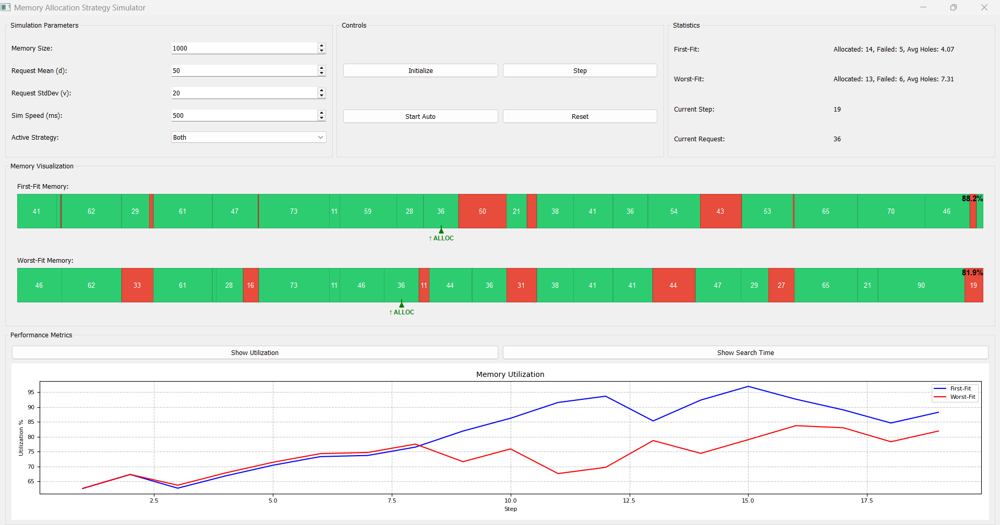

# Memory Allocation Strategy Simulator

A visual educational tool that demonstrates different memory allocation strategies in operating systems.



## Overview

This application simulates and visualizes how different memory allocation algorithms work in operating systems. It provides a real-time comparison between First-Fit and Worst-Fit memory allocation strategies, allowing users to observe differences in memory utilization, fragmentation, and search efficiency.

## Features

- **Interactive Visualization**: Real-time visual representation of memory blocks (allocated and free)
- **Multiple Allocation Strategies**: Compare First-Fit and Worst-Fit algorithms side by side
- **Performance Metrics**: Track memory utilization and search efficiency over time
- **Customizable Parameters**: Adjust memory size, request patterns, and simulation speed
- **Action Indicators**: Visual feedback for memory allocations and releases
- **Statistical Analysis**: View allocation success rates and search efficiency

## Memory Allocation Strategies

The simulator demonstrates two common memory allocation strategies:

- **First-Fit**: Allocates memory in the first hole that's large enough to accommodate the request
- **Worst-Fit**: Allocates memory in the largest available hole

## Getting Started

### Prerequisites

- Python 3.6 or higher
- PyQt5
- NumPy
- Matplotlib

### Installation

1. Clone this repository or download the source code
2. Install the required dependencies:

```bash
pip install PyQt5 numpy matplotlib
```

3. Run the application:

```bash
python memory_simulator.py
```

## Usage Guide

### Simulation Parameters

- **Memory Size**: Total memory units available for allocation
- **Request Mean (d)**: Average size of memory requests
- **Request StdDev (v)**: Standard deviation of memory request sizes
- **Sim Speed (ms)**: Time between automatic simulation steps
- **Active Strategy**: Choose which allocation strategies to display

### Controls

- **Initialize**: Set up a new simulation with the current parameters
- **Step**: Execute a single simulation step
- **Start Auto/Stop Auto**: Toggle automatic simulation execution
- **Reset**: Clear the current simulation and start over

### View Options

- **Show Utilization**: Display a graph of memory utilization over time
- **Show Search Time**: Display a graph of average holes examined per request

## How the Simulation Works

1. Memory is initially segmented into alternating allocated and free blocks
2. On each step, a new memory request is generated
3. The allocation strategies attempt to satisfy the request
4. If allocation succeeds, the memory map is updated
5. If allocation fails, a random allocated block is released
6. Performance metrics are collected and displayed in real-time

## Understanding the Visualization

- **Green Blocks**: Allocated memory segments
- **Red Blocks**: Free memory segments (holes)
- **Numbers Inside Blocks**: Size of each memory segment
- **Arrows**: Indicate recent allocation or release operations
- **Percentage**: Current memory utilization

## Performance Metrics
- **Memory Utilization**: Percentage of total memory that is allocated
- **Search Efficiency**: Average number of holes examined per successful allocation
- **Success/Failure Rates**: Number of successful allocations vs. failed requests

## Educational Value
This simulator helps demonstrate important concepts in operating systems:
- Memory fragmentation
- Trade-offs between different allocation strategies
- Performance implications of allocation decisions
- How memory coalescing works
